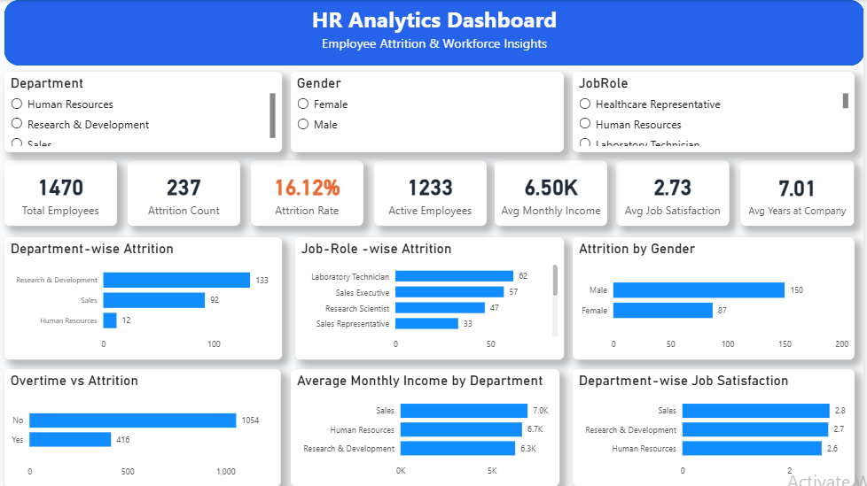

# 📊 HR Analytics Dashboard | Power BI
### Interactive HR Dashboard for Employee Attrition Analysis & Workforce Insights

## 📌 Project Overview

This project presents an interactive HR Analytics Dashboard built in Power BI to analyze employee attrition, workforce trends, and key HR metrics. The dashboard helps HR teams identify attrition patterns and supports data-driven decision-making through interactive visualizations and business-focused KPIs.

---

## 📷 Dashboard Preview

---

## 🎯 Objectives

- Analyze employee attrition trends.
- Identify departments and job roles with high attrition.
- Compare attrition across gender and overtime.
- Monitor workforce KPIs.
- Provide actionable HR insights.

---

## 📈 Key KPIs

- Total Employees
- Active Employees
- Attrition Count
- Attrition Rate
- Average Monthly Income
- Average Job Satisfaction
- Average Years at Company

---

## 📊 Dashboard Visuals

- Department-wise Attrition
- Job Role-wise Attrition
- Attrition by Gender
- Overtime vs Attrition
- Average Monthly Income by Department
- Department-wise Job Satisfaction

---

## 🛠 Tools & Technologies

| Tool | Purpose |
|------|---------|
| Power BI | Dashboard Development |
| Power Query | Data Cleaning & Transformation |
| DAX | KPI & Measure Calculations |
| Data Modeling | Relationships & Analysis |

---

## 💡 Key Business Insights

- Identified departments with the highest employee attrition.
- Compared attrition across different job roles.
- Analyzed the relationship between overtime and employee turnover.
- Evaluated workforce satisfaction and average monthly income.
- Built an interactive dashboard to support HR decision-making.

---

## 📂 Repository Structure

HR-Analytics-Dashboard-PowerBI
│
├── HR_Analytics_Dashboard.pbix
├── HR_Employee_Attrition.csv
├── Dashboard_Screenshot.png
└── README.md

---

## 🚀 How to Use

1. Download the `.pbix` file.
2. Open it using Microsoft Power BI Desktop.
3. Refresh the dataset if required.
4. Explore the dashboard using interactive slicers.

---

## 👩‍💻 Author

**Unnati Navlani**

Aspiring Data Analyst

**Skills:** SQL • Power BI • Excel • Python (Learning)

---

⭐ **If you found this project helpful, consider giving it a Star!**
